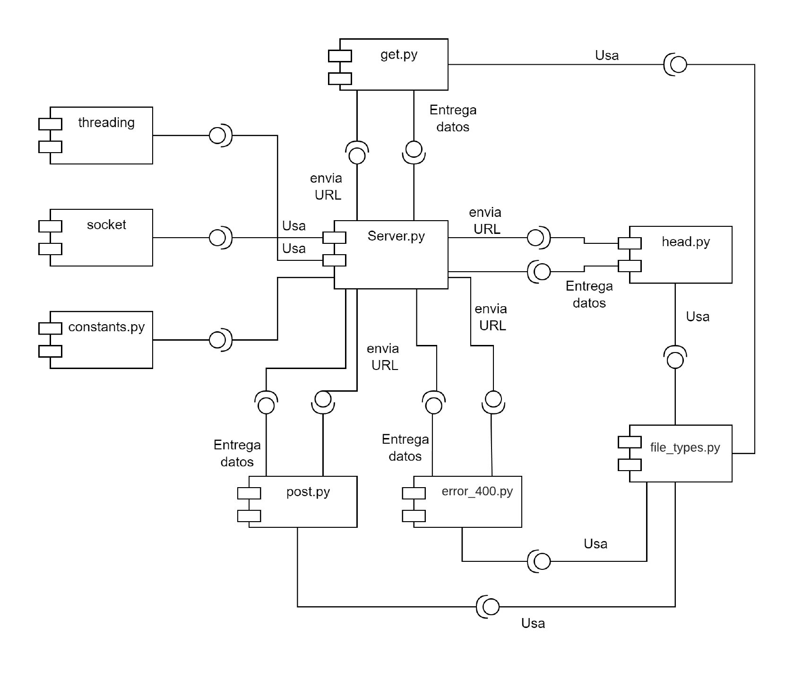

# **Documentacion TWS Telematica**

*******

**Tabla de Contenido**

1. [Introducción](#introduction)
2. [Desarrollo](#development)
3. [Conclusiones](#conclusion) 
4. [Referencias](#references) 

*******

 

### **i. Introduccion**
Un servidor HTTP/1.1 es un tipo de servidor web que utiliza la versión 1.1 del protocolo HTTP (HyperText Transfer Protocol) para comunicarse con los clientes que solicitan recursos en la web. Este protocolo es uno de los más utilizados en la actualidad para la comunicación entre servidores y clientes en la World Wide Web.

El protocolo HTTP/1.1 se diferencia de la versión anterior, HTTP/1.0, en varios aspectos, incluyendo mejoras en el rendimiento y la seguridad. Una de las principales características de HTTP/1.1 es la capacidad de mantener una conexión persistente entre el servidor y el cliente, lo que permite la transferencia de múltiples recursos en una sola conexión. Además, HTTP/1.1 introduce nuevas funciones, como la compresión de contenido, la negociación de contenido y el control de caché mejorado.

La implementación de un servidor HTTP/1.1 implica la creación de un programa que pueda recibir y procesar solicitudes de los clientes, y responder con los recursos correspondientes. El servidor también debe ser capaz de manejar múltiples conexiones simultáneas y mantener una alta disponibilidad, ya que es común que múltiples clientes soliciten recursos al mismo tiempo.

En resumen, un servidor HTTP/1.1 es una herramienta esencial para cualquier sitio web, ya que es el encargado de proporcionar los recursos solicitados por los clientes de manera rápida y eficiente, utilizando el protocolo de comunicación HTTP/1.1 para garantizar una comunicación segura y confiable.
*******

 

### **ii. Desarrollo**
Python es un lenguaje de programación muy popular para el desarrollo de servidores y aplicaciones web debido a varias razones:

1.Fácil de aprender: Python tiene una sintaxis muy legible y fácil de entender, lo que lo hace ideal para programadores nuevos y experimentados.

2.Gran cantidad de bibliotecas: Python tiene una gran cantidad de bibliotecas disponibles que hacen que el desarrollo web sea mucho más fácil y rápido. Algunas bibliotecas populares para el desarrollo de servidores web son Flask, Django y Pyramid.

3.Rendimiento: Python es un lenguaje interpretado, pero gracias a su eficiente manejo de memoria y a las bibliotecas optimizadas, puede ser muy rápido para ciertas tareas.

4.Flexibilidad: Python es un lenguaje muy versátil, lo que lo hace ideal para una variedad de tareas de desarrollo web, desde aplicaciones pequeñas hasta proyectos de gran envergadura.

Se tuvieron en cuenta varios aspectos importantes en el desarrollo:

1.El uso de sockets para establecer conexiones entre el servidor y los clientes.

2.El uso de hilos para manejar múltiples conexiones simultáneas.

3.La implementación de tres métodos HTTP: GET, HEAD y POST.

4.El manejo de errores y estados de respuesta HTTP (tales como 404 Not Found o 200 OK).

5.La gestión de los encabezados HTTP en las respuestas, incluyendo la fecha, el servidor, el tipo de contenido, la longitud del contenido y otros atributos.

6.La implementación de la funcionalidad de Keep-Alive para permitir que las conexiones permanezcan abiertas durante un tiempo determinado después de que se complete una solicitud.

7.El uso de constantes para evitar la duplicación de código y facilitar la actualización del servidor.

Presentamos un diagrama de componentes, para visualizar la articulación del codigo, quiza facilite la comprension del desarrollo del proyecto:

Se manejan estados y errores como lo son:

* **200 OK**: Indica que la peticion fue entregada con exito.
* **400 Bad Request**: Indica que la peticion realizada es incorrecta.
* **404 Not Found**: Indica que el archivo requerido no fue encontrado dentro del servidor.
* **405 Method Not Allowed**: Indica que la peticion no se puede realizar en la direccion especificada.

*******

 

### **iii. Conclusiones**
En primer lugar, el proyecto te brinda la oportunidad de aplicar y poner en práctica los conocimientos teóricos que has adquirido en tus estudios o por tu cuenta. Al enfrentarte a desafíos reales durante el proceso de construcción, puedes aprender nuevas habilidades y técnicas, así como profundizar en tus conocimientos existentes.

Además, al crear un servidor desde cero, se requiere un enfoque metodológico y sistemático, lo que puede ayudarte a desarrollar tus habilidades de resolución de problemas y pensamiento crítico. También te permite trabajar en equipo si estás colaborando en el proyecto, lo que es una habilidad importante en cualquier entorno laboral.

Por último, construir un servidor también te brinda la oportunidad de aprender sobre las últimas tecnologías y tendencias en el campo de la informática, lo que puede ser útil para tus futuros proyectos y trabajos en la industria. En general, realizar este servidor como trabajo de aprendizaje puede ayudarte a mejorar tus habilidades técnicas y personales, lo que te permitirá ser un mejor profesional en el futuro.
*******

 

### **iv. Referencias**
* https://github.com/ST0255/st0255-20231/tree/main/LabSocketsMultiThread
* https://datatracker.ietf.org/doc/rfc2616/
* https://www.postman.com/
*******
